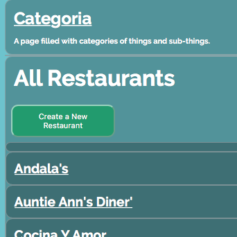

## Categoria : A Restaurants and Menus App



This is a catalog website that stores and displays restaurants, menus and menu items. It also permits adding and deleting entries. It was created for a Udacity project and is hosted on an AWS instance, the live website can be found at the [www.restaurantstuff.info](www.restaurantstuff.info)

## Requirements

- [VirtualBox](https://www.virtualbox.org/)
- [Vagrant](https://www.vagrantup.com/)
- [Python 2.7](https://www.python.org/download/releases/2.7/)

## Quick Start

1. Download and place this application folder on your computer. 
2. Download and install [VirtualBox](https://www.virtualbox.org/), this will run the virtual machine for this application.
3. Download and install [Vagrant](https://www.vagrantup.com/), A command line utility for management of virtual machines.
4. Download and install [Python 2.7](https://www.python.org/download/releases/2.7/) To check to see if you already have Python installed as well as what version, in a command prompt type `python --version`.

Once everything is installed, using a command line interface (if youre on a mac you can use Terminal) navigate to the root application folder `~/restaurants_and_menus` and type `vagrant up`. This process may take a while, if you encounter any errors refer to [Vagrant's Troubleshooting Guide](https://www.vagrantup.com/docs/other/debugging.html).

Once the process is complete, type `vagrant ssh` and press `enter` you should then see something like 
```
The shared directory is located at /vagrant
To access your shared files: cd /vagrant
```
Follow those instructions and navigate to `/vagrant` once inside the vagrant folder, you then need to navigate to `/my_restaurants_and_menus`.  Now, type `python project.py`and press `enter`

The application should now be running locally on your machine, you can access it using your web browser and going to the url `localhost:5000/`

